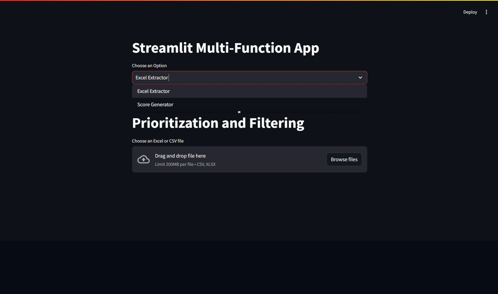
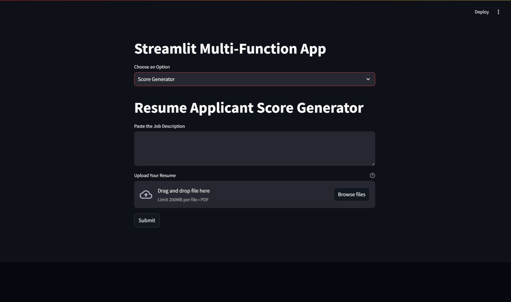

# Applicant Management

Applicant Management is a Streamlit application designed to assist with managing job applications and scoring resumes based on job descriptions. It features an Excel extractor for prioritizing and filtering columns, and a resume score generator for evaluating resumes against job descriptions using Google's generative AI.

## Table of Contents

- [Installation](#installation)
- [Usage](#usage)
- [Features](#features)
  - [Excel Extractor](#excel-extractor)
  - [Score Generator](#score-generator)
- [Configuration](#configuration)
- [License](#license)

## Installation

1. **Clone the repository:**

   ```bash
   git clone https://github.com/An1rud/Applicant-Management.git
   cd Applicant-Management
   ```

2. **Create a virtual environment and activate it:**

   ```bash
   python -m venv venv
   source venv/bin/activate  # On Windows, use `venv\Scripts\activate`
   ```

3. **Install the required packages:**

   ```bash
   pip install -r requirements.txt
   ```

4. **Set up your environment variables:**

   Create a `.env` file in the root directory of the project and add your Google API key:

   ```env
   GOOGLE_API_KEY=your_google_api_key
   ```

5. **Run the Streamlit app:**

   ```bash
   streamlit run app.py
   ```

## Usage

### Excel Extractor

1. **Upload a File:**
   - Select "Excel Extractor" from the dropdown menu.
   - Upload an Excel or CSV file.

   

2. **Select Columns:**
   - Choose the columns you want to prioritize from the multiselect dropdown.

3. **Set Column Priorities:**
   - Assign priorities to the selected columns.

4. **Set Filters (Optional):**
   - Filter the data based on the selected columns' values.

5. **Download Filtered Data:**
   - Download the filtered data as a CSV file.

6. **Download PDFs from Drive Links:**
   - If the filtered data contains Google Drive links to resumes, the app will download them and package them into a ZIP file for easy download.

### Score Generator

1. **Input Job Description:**
   - Paste the job description into the provided text area.

   

2. **Upload Resume:**
   - Upload the resume in PDF format.

3. **Submit for Scoring:**
   - Click the submit button to generate the score and missing keywords based on the job description.

## Features

### Excel Extractor

- **File Upload:** Supports Excel and CSV file formats.
- **Column Prioritization:** Select and prioritize columns.
- **Data Filtering:** Filter data based on column values.
- **PDF Download:** Download PDFs from Google Drive links in the data and package them into a ZIP file.

### Score Generator

- **Job Description Analysis:** Analyze resumes against job descriptions using Google's generative AI.
- **Resume Scoring:** Generate a score and identify missing keywords for improvement.
- **Profile Summary:** Provide a summary of the profile based on the job description and resume content.

## Configuration

To configure the application, ensure that you have a valid Google API key. This key is used for the resume scoring functionality.

1. **Create a `.env` file in the project root directory.**
2. **Add your Google API key to the `.env` file:**

   ```env
   GOOGLE_API_KEY=your_google_api_key
   ```

## License

This project is licensed under the MIT License.

